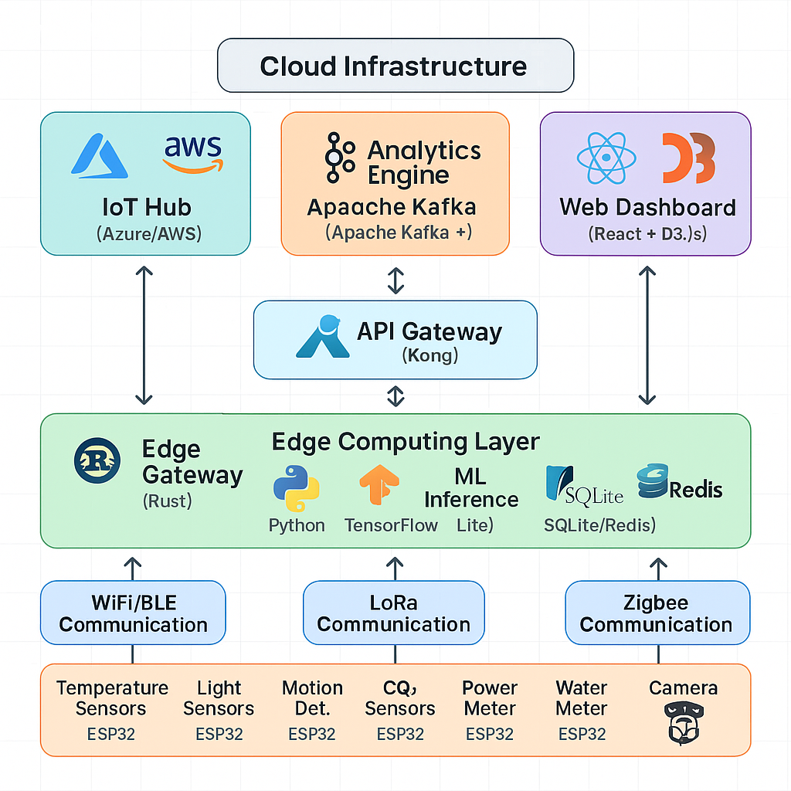

# IoT & Embedded Systems Ecosystem Tutorial

## Overview

This tutorial demonstrates building a complete IoT ecosystem from embedded devices to cloud analytics, covering hardware interfaces, edge computing, real-time communication, and data processing pipelines. We'll create a smart building management system using Rust for embedded devices, various communication protocols, and cloud-based analytics.

## System Architecture Overview



## Embedded Device Layer (Rust)

### ESP32 Temperature Sensor Node

```rust
// embedded-devices/temperature-sensor/src/main.rs
#![no_std]
#![no_main]

use esp_idf_sys as _; // Required for linking
use esp_idf_hal::{
    delay::FreeRtos,
    gpio::*,
    i2c::*,
    peripherals::Peripherals,
    prelude::*,
};
use esp_idf_svc::{
    eventloop::EspSystemEventLoop,
    http::client::*,
    wifi::*,
    mqtt::client::*,
    nvs::EspDefaultNvsPartition,
    timer::EspTimerService,
};
use embedded_svc::{
    http::client::Client,
    mqtt::client::{Connection, MessageImpl, Publish, QoS},
    wifi::{AuthMethod, ClientConfiguration, Configuration},
};
use serde::{Deserialize, Serialize};
use log::*;

// Sensor data structure
#[derive(Serialize, Deserialize, Debug, Clone)]
struct SensorReading {
    device_id: String,
    sensor_type: String,
    temperature: f32,
    humidity: f32,
    timestamp: u64,
    battery_level: f32,
    signal_strength: i32,
}

// Configuration structure
#[derive(Serialize, Deserialize, Debug)]
struct DeviceConfig {
    wifi_ssid: String,
    wifi_password: String,
    mqtt_broker: String,
    mqtt_topic: String,
    device_id: String,
    sampling_interval: u64, // in seconds
}

struct TemperatureSensorDevice {
    config: DeviceConfig,
    wifi: EspWifi<'static>,
    mqtt_client: EspMqttClient<'static>,
    dht22: DHT22Sensor,
    last_reading: Option<SensorReading>,
}

impl TemperatureSensorDevice {
    fn new() -> anyhow::Result<Self> {
        let peripherals = Peripherals::take().unwrap();
        let sys_loop = EspSystemEventLoop::take()?;
        let nvs = EspDefaultNvsPartition::take()?;

        // Load configuration from NVS or use defaults
        let config = Self::load_config(&nvs)?;

        // Initialize WiFi
        let mut wifi = EspWifi::new(peripherals.modem, sys_loop.clone(), Some(nvs.clone()))?;

        // Initialize MQTT client
        let mqtt_config = MqttClientConfiguration {
            client_id: Some(&config.device_id),
            ..Default::default()
        };

        let mut mqtt_client = EspMqttClient::new_with_conn(
            &config.mqtt_broker,
            &mqtt_config,
            move |message_event| {
                match message_event {
                    Ok(Received(msg)) => {
                        info!("Received MQTT message: {:?}", msg);
                        Self::handle_mqtt_message(msg);
                    }
                    _ => {}
                }
            },
        )?;

        // Initialize DHT22 sensor
        let dht22 = DHT22Sensor::new(peripherals.pins.gpio4.into_input_output()?);

        Ok(Self {
            config,
            wifi,
            mqtt_client,
            dht22,
            last_reading: None,
        })
    }

    fn load_config(nvs: &EspDefaultNvsPartition) -> anyhow::Result<DeviceConfig> {
        // Try to load from NVS, otherwise use defaults
        Ok(DeviceConfig {
            wifi_ssid: "SmartBuilding_IoT".to_string(),
            wifi_password: "SecurePassword123".to_string(),
            mqtt_broker: "mqtt://192.168.1.100:1883".to_string(),
            mqtt_topic: "sensors/temperature".to_string(),
            device_id: "temp_sensor_01".to_string(),
            sampling_interval: 30, // 30 seconds
        })
    }

    fn connect_wifi(&mut self) -> anyhow::Result<()> {
        let wifi_configuration = Configuration::Client(ClientConfiguration {
            ssid: self.config.wifi_ssid.clone(),
            password: self.config.wifi_password.clone(),
            auth_method: AuthMethod::WPA2Personal,
            ..Default::default()
        });

        self.wifi.set_configuration(&wifi_configuration)?;
        self.wifi.start()?;

        info!("Starting WiFi...");
        self.wifi.connect()?;

        // Wait for connection
        while !self.wifi.is_connected()? {
            let config = self.wifi.get_configuration()?;
            info!("Waiting for station {:?}", config);
            FreeRtos::delay_ms(1000);
        }

        info!("WiFi connected successfully");
        Ok(())
    }

    fn read_sensors(&mut self) -> anyhow::Result<SensorReading> {
        let (temperature, humidity) = self.dht22.read()?;

        // Get system info
        let timestamp = self.get_timestamp();
        let battery_level = self.read_battery_level()?;
        let signal_strength = self.get_wifi_signal_strength()?;

        let reading = SensorReading {
            device_id: self.config.device_id.clone(),
            sensor_type: "DHT22".to_string(),
            temperature,
            humidity,
            timestamp,
            battery_level,
            signal_strength,
        };

        self.last_reading = Some(reading.clone());
        Ok(reading)
    }

    fn publish_reading(&mut self, reading: &SensorReading) -> anyhow::Result<()> {
        let payload = serde_json::to_string(reading)?;

        self.mqtt_client.publish(
            &self.config.mqtt_topic,
            QoS::AtMostOnce,
            false,
            payload.as_bytes(),
        )?;

        info!("Published reading: {}", payload);
        Ok(())
    }

    fn handle_mqtt_message(msg: &MessageImpl) {
        // Handle incoming MQTT messages for device configuration updates
        if let Ok(topic) = std::str::from_utf8(msg.topic()) {
            if topic.contains("config") {
                if let Ok(payload) = std::str::from_utf8(msg.data()) {
                    info!("Received config update: {}", payload);
                    // Update device configuration
                }
            } else if topic.contains("command") {
                if let Ok(command) = std::str::from_utf8(msg.data()) {
                    info!("Received command: {}", command);
                    // Handle device commands (restart, calibrate, etc.)
                }
            }
        }
    }

    fn get_timestamp(&self) -> u64 {
        // Get current timestamp (implement proper time sync via NTP)
        esp_idf_sys::esp_timer_get_time() as u64 / 1000000 // Convert to seconds
    }

    fn read_battery_level(&self) -> anyhow::Result<f32> {
        // Read battery voltage from ADC
        // This is a simplified implementation
        Ok(3.7) // Placeholder for actual battery reading
    }

    fn get_wifi_signal_strength(&self) -> anyhow::Result<i32> {
        // Get WiFi RSSI
        Ok(-45) // Placeholder for actual RSSI reading
    }

    fn enter_deep_sleep(&self, duration_ms: u64) -> anyhow::Result<()> {
        info!("Entering deep sleep for {} ms", duration_ms);

        unsafe {
            esp_idf_sys::esp_sleep_enable_timer_wakeup(duration_ms * 1000); // microseconds
            esp_idf_sys::esp_deep_sleep_start();
        }

        Ok(())
    }

    fn run(&mut self) -> anyhow::Result<()> {
        info!("Starting temperature sensor device...");

        // Connect to WiFi
        self.connect_wifi()?;

        // Connect to MQTT broker
        info!("Connecting to MQTT broker...");
        // MQTT connection is handled in the constructor

        loop {
            // Read sensor data
            match self.read_sensors() {
                Ok(reading) => {
                    info!("Sensor reading: T={}°C, H={}%", reading.temperature, reading.humidity);

                    // Publish to MQTT
                    if let Err(e) = self.publish_reading(&reading) {
                        error!("Failed to publish reading: {}", e);
                    }

                    // Store locally for offline capability
                    self.store_reading_locally(&reading)?;

                    // Check if we should enter power-saving mode
                    if self.should_enter_sleep_mode()? {
                        let sleep_duration = self.config.sampling_interval * 1000;
                        self.enter_deep_sleep(sleep_duration)?;
                    }
                }
                Err(e) => {
                    error!("Failed to read sensors: {}", e);
                }
            }

            // Wait for next sampling interval
            FreeRtos::delay_ms((self.config.sampling_interval * 1000) as u32);
        }
    }

    fn store_reading_locally(&self, reading: &SensorReading) -> anyhow::Result<()> {
        // Store reading in local flash for offline capability
        // Implementation depends on available storage
        info!("Storing reading locally: {:?}", reading);
        Ok(())
    }

    fn should_enter_sleep_mode(&self) -> anyhow::Result<bool> {
        // Determine if device should enter sleep mode based on battery level, etc.
        let battery_level = self.read_battery_level()?;
        Ok(battery_level < 3.3) // Enter sleep if battery is low
    }
}

// DHT22 sensor driver (simplified)
struct DHT22Sensor {
    pin: PinDriver<'static, AnyIOPin, InputOutput>,
}

impl DHT22Sensor {
    fn new(pin: PinDriver<'static, AnyIOPin, InputOutput>) -> Self {
        Self { pin }
    }

    fn read(&mut self) -> anyhow::Result<(f32, f32)> {
        // Implement DHT22 communication protocol
        // This is a simplified placeholder
        Ok((25.5, 60.0)) // Temperature: 25.5°C, Humidity: 60%
    }
}

fn main() -> anyhow::Result<()> {
    esp_idf_sys::link_patches();
    esp_idf_svc::log::EspLogger::initialize_default();

    let mut device = TemperatureSensorDevice::new()?;
    device.run()?;

    Ok(())
}
```

### Multi-Sensor Hub (Rust + Embassy)

```rust
// embedded-devices/sensor-hub/src/main.rs
#![no_std]
#![no_main]
#![feature(async_fn_in_trait)]

use embassy_executor::Spawner;
use embassy_time::{Duration, Timer};
use embassy_sync::{blocking_mutex::raw::CriticalSectionRawMutex, mutex::Mutex};
use embassy_net::{
    tcp::TcpSocket, Config, Stack, StackResources,
    dns::DnsSocket, dhcpv4::simple::Dhcpv4Socket,
};
use embassy_embedded_hal::shared_bus::asynch::i2c::I2cDevice;
use embassy_futures::select::{select, Either};
use static_cell::StaticCell;
use heapless::{Vec, String};
use serde::{Deserialize, Serialize};
use log::*;

// Sensor data structures
#[derive(Serialize, Deserialize, Debug, Clone)]
struct MultiSensorReading {
    device_id: String,
    timestamp: u64,
    sensors: Vec<SensorData, 8>, // Max 8 sensors
    location: Location,
    metadata: SensorMetadata,
}

#[derive(Serialize, Deserialize, Debug, Clone)]
struct SensorData {
    sensor_id: String,
    sensor_type: SensorType,
    value: f32,
    unit: String,
    quality: u8, // 0-100 quality indicator
}

#[derive(Serialize, Deserialize, Debug, Clone)]
enum SensorType {
    Temperature,
    Humidity,
    Pressure,
    AirQuality,
    Light,
    Motion,
    Sound,
    CO2,
}

#[derive(Serialize, Deserialize, Debug, Clone)]
struct Location {
    building_id: String,
    floor: u8,
    room: String,
    coordinates: (f32, f32), // x, y within room
}

#[derive(Serialize, Deserialize, Debug, Clone)]
struct SensorMetadata {
    firmware_version: String,
    battery_level: f32,
    signal_strength: i32,
    uptime: u32,
    memory_usage: u32,
}

// Sensor hub state
static SENSOR_READINGS: Mutex<CriticalSectionRawMutex, Vec<MultiSensorReading, 32>> =
    Mutex::new(Vec::new());

static NETWORK_STACK: StaticCell<Stack<embassy_net::driver::Driver<'static>>> = StaticCell::new();

#[embassy_executor::task]
async fn network_task(stack: &'static Stack<embassy_net::driver::Driver<'static>>) -> ! {
    stack.run().await
}

#[embassy_executor::task]
async fn sensor_reading_task() {
    let mut interval = Timer::after(Duration::from_secs(10));

    loop {
        interval.next().await;

        // Read all sensors
        let reading = collect_sensor_data().await;

        // Store in local buffer
        {
            let mut readings = SENSOR_READINGS.lock().await;
            if readings.len() >= 32 {
                readings.remove(0); // Remove oldest reading
            }
            readings.push(reading).ok();
        }

        info!("Collected sensor data");
    }
}

#[embassy_executor::task]
async fn data_transmission_task(stack: &'static Stack<embassy_net::driver::Driver<'static>>) {
    let mut interval = Timer::after(Duration::from_secs(30));

    loop {
        interval.next().await;

        // Get readings to transmit
        let readings = {
            let mut readings = SENSOR_READINGS.lock().await;
            let to_send = readings.clone();
            readings.clear();
            to_send
        };

        if !readings.is_empty() {
            match transmit_data(stack, &readings).await {
                Ok(_) => info!("Successfully transmitted {} readings", readings.len()),
                Err(e) => error!("Failed to transmit data: {:?}", e),
            }
        }
    }
}

#[embassy_executor::task]
async fn edge_processing_task() {
    let mut interval = Timer::after(Duration::from_secs(60));

    loop {
        interval.next().await;

        // Perform local edge processing
        let analysis = perform_edge_analysis().await;

        if analysis.anomaly_detected {
            warn!("Anomaly detected: {:?}", analysis);
            // Trigger immediate alert
            send_alert(&analysis).await.ok();
        }

        // Local decision making
        match analysis.recommendation {
            EdgeRecommendation::AdjustHVAC(temp) => {
                info!("Adjusting HVAC to {}°C", temp);
                control_hvac(temp).await.ok();
            }
            EdgeRecommendation::AdjustLighting(brightness) => {
                info!("Adjusting lighting to {}%", brightness);
                control_lighting(brightness).await.ok();
            }
            EdgeRecommendation::None => {}
        }
    }
}

async fn collect_sensor_data() -> MultiSensorReading {
    let mut sensors = Vec::new();

    // Read temperature/humidity sensor (BME280)
    if let Ok((temp, hum, pres)) = read_bme280().await {
        sensors.push(SensorData {
            sensor_id: "BME280_01".into(),
            sensor_type: SensorType::Temperature,
            value: temp,
            unit: "°C".into(),
            quality: 95,
        }).ok();

        sensors.push(SensorData {
            sensor_id: "BME280_01".into(),
            sensor_type: SensorType::Humidity,
            value: hum,
            unit: "%RH".into(),
            quality: 95,
        }).ok();

        sensors.push(SensorData {
            sensor_id: "BME280_01".into(),
            sensor_type: SensorType::Pressure,
            value: pres,
            unit: "hPa".into(),
            quality: 95,
        }).ok();
    }

    // Read air quality sensor (SGP30)
    if let Ok((co2, tvoc)) = read_sgp30().await {
        sensors.push(SensorData {
            sensor_id: "SGP30_01".into(),
            sensor_type: SensorType::CO2,
            value: co2,
            unit: "ppm".into(),
            quality: 90,
        }).ok();

        sensors.push(SensorData {
            sensor_id: "SGP30_01".into(),
            sensor_type: SensorType::AirQuality,
            value: tvoc,
            unit: "ppb".into(),
            quality: 90,
        }).ok();
    }

    // Read light sensor (BH1750)
    if let Ok(lux) = read_bh1750().await {
        sensors.push(SensorData {
            sensor_id: "BH1750_01".into(),
            sensor_type: SensorType::Light,
            value: lux,
            unit: "lux".into(),
            quality: 98,
        }).ok();
    }

    // Read motion sensor (PIR)
    let motion = read_pir_sensor().await;
    sensors.push(SensorData {
        sensor_id: "PIR_01".into(),
        sensor_type: SensorType::Motion,
        value: if motion { 1.0 } else { 0.0 },
        unit: "bool".into(),
        quality: 100,
    }).ok();

    MultiSensorReading {
        device_id: "sensor_hub_01".into(),
        timestamp: get_timestamp(),
        sensors,
        location: Location {
            building_id: "MAIN_BUILDING".into(),
            floor: 2,
            room: "OFFICE_201".into(),
            coordinates: (5.5, 3.2),
        },
        metadata: SensorMetadata {
            firmware_version: "1.2.3".into(),
            battery_level: 87.5,
            signal_strength: -42,
            uptime: get_uptime(),
            memory_usage: get_memory_usage(),
        },
    }
}

async fn transmit_data(
    stack: &Stack<embassy_net::driver::Driver<'static>>,
    readings: &[MultiSensorReading]
) -> Result<(), TransmissionError> {
    // Prepare data for transmission
    let payload = prepare_transmission_payload(readings)?;

    // Try different transmission methods in order of preference

    // 1. Try WiFi/Ethernet HTTP POST
    if let Ok(_) = send_via_http(stack, &payload).await {
        return Ok(());
    }

    // 2. Try MQTT
    if let Ok(_) = send_via_mqtt(stack, &payload).await {
        return Ok(());
    }

    // 3. Try LoRa (for long-range, low-power transmission)
    if let Ok(_) = send_via_lora(&payload).await {
        return Ok(());
    }

    // 4. Store for later transmission
    store_for_retry(&payload).await?;

    Err(TransmissionError::AllMethodsFailed)
}

async fn send_via_http(
    stack: &Stack<embassy_net::driver::Driver<'static>>,
    payload: &TransmissionPayload
) -> Result<(), NetworkError> {
    let mut rx_buffer = [0; 4096];
    let mut tx_buffer = [0; 4096];
    let mut socket = TcpSocket::new(stack, &mut rx_buffer, &mut tx_buffer);

    // Connect to server
    let remote_endpoint = (
        embassy_net::Ipv4Address::new(192, 168, 1, 100),
        8080
    );

    socket.connect(remote_endpoint).await?;

    // Prepare HTTP request
    let json_data = serde_json::to_string(payload).map_err(|_| NetworkError::SerializationError)?;

    let request = format!(
        "POST /api/sensors/data HTTP/1.1\r\n\
         Host: 192.168.1.100:8080\r\n\
         Content-Type: application/json\r\n\
         Content-Length: {}\r\n\
         Connection: close\r\n\r\n{}",
        json_data.len(),
        json_data
    );

    // Send request
    socket.write_all(request.as_bytes()).await?;

    // Read response
    let mut response = [0; 1024];
    let n = socket.read(&mut response).await?;
    let response_str = core::str::from_utf8(&response[..n])
        .map_err(|_| NetworkError::InvalidResponse)?;

    // Check if successful
    if response_str.contains("200 OK") {
        Ok(())
    } else {
        Err(NetworkError::ServerError)
    }
}

// Edge processing and analysis
#[derive(Debug)]
struct EdgeAnalysis {
    anomaly_detected: bool,
    anomaly_type: Option<AnomalyType>,
    recommendation: EdgeRecommendation,
    confidence: f32,
}

#[derive(Debug)]
enum AnomalyType {
    TemperatureSpike,
    HumidityOutOfRange,
    AirQualityPoor,
    MotionUnexpected,
}

#[derive(Debug)]
enum EdgeRecommendation {
    AdjustHVAC(f32), // Target temperature
    AdjustLighting(u8), // Brightness percentage
    None,
}

async fn perform_edge_analysis() -> EdgeAnalysis {
    let readings = SENSOR_READINGS.lock().await;

    if readings.is_empty() {
        return EdgeAnalysis {
            anomaly_detected: false,
            anomaly_type: None,
            recommendation: EdgeRecommendation::None,
            confidence: 0.0,
        };
    }

    // Get latest reading
    let latest = &readings[readings.len() - 1];

    // Simple rule-based anomaly detection
    let mut anomalies = Vec::<AnomalyType, 4>::new();

    for sensor in &latest.sensors {
        match sensor.sensor_type {
            SensorType::Temperature => {
                if sensor.value > 30.0 || sensor.value < 15.0 {
                    anomalies.push(AnomalyType::TemperatureSpike).ok();
                }
            }
            SensorType::Humidity => {
                if sensor.value > 80.0 || sensor.value < 20.0 {
                    anomalies.push(AnomalyType::HumidityOutOfRange).ok();
                }
            }
            SensorType::CO2 => {
                if sensor.value > 1000.0 {
                    anomalies.push(AnomalyType::AirQualityPoor).ok();
                }
            }
            _ => {}
        }
    }

    // Generate recommendations
    let recommendation = if !anomalies.is_empty() {
        match anomalies[0] {
            AnomalyType::TemperatureSpike => {
                if let Some(temp_sensor) = latest.sensors.iter()
                    .find(|s| matches!(s.sensor_type, SensorType::Temperature)) {
                    if temp_sensor.value > 25.0 {
                        EdgeRecommendation::AdjustHVAC(22.0)
                    } else {
                        EdgeRecommendation::AdjustHVAC(24.0)
                    }
                } else {
                    EdgeRecommendation::None
                }
            }
            _ => EdgeRecommendation::None,
        }
    } else {
        EdgeRecommendation::None
    };

    EdgeAnalysis {
        anomaly_detected: !anomalies.is_empty(),
        anomaly_type: anomalies.get(0).cloned(),
        recommendation,
        confidence: if anomalies.is_empty() { 0.0 } else { 0.85 },
    }
}

// Hardware abstraction layer
async fn read_bme280() -> Result<(f32, f32, f32), SensorError> {
    // Implement BME280 I2C communication
    // Returns (temperature, humidity, pressure)
    Ok((23.5, 45.2, 1013.25))
}

async fn read_sgp30() -> Result<(f32, f32), SensorError> {
    // Implement SGP30 I2C communication
    // Returns (CO2 ppm, TVOC ppb)
    Ok((400.0, 25.0))
}

async fn read_bh1750() -> Result<f32, SensorError> {
    // Implement BH1750 I2C communication
    // Returns light level in lux
    Ok(250.0)
}

async fn read_pir_sensor() -> bool {
    // Read PIR motion sensor
    false // Placeholder
}

async fn control_hvac(target_temp: f32) -> Result<(), ControlError> {
    // Send HVAC control command
    info!("HVAC control: Setting target temperature to {}°C", target_temp);
    Ok(())
}

async fn control_lighting(brightness: u8) -> Result<(), ControlError> {
    // Send lighting control command
    info!("Lighting control: Setting brightness to {}%", brightness);
    Ok(())
}

#[embassy_executor::main]
async fn main(spawner: Spawner) {
    info!("Starting IoT Sensor Hub...");

    // Initialize network stack
    let stack = &*NETWORK_STACK.init(Stack::new(
        // Network driver initialization here
    ));

    // Spawn tasks
    spawner.spawn(network_task(stack)).unwrap();
    spawner.spawn(sensor_reading_task()).unwrap();
    spawner.spawn(data_transmission_task(stack)).unwrap();
    spawner.spawn(edge_processing_task()).unwrap();

    info!("All tasks spawned, running main loop...");

    // Main application loop
    loop {
        Timer::after(Duration::from_secs(60)).await;
        info!("System heartbeat - uptime: {} seconds", get_uptime());
    }
}

// Utility functions and error types
fn get_timestamp() -> u64 {
    // Get current Unix timestamp
    0 // Placeholder - implement NTP sync
}

fn get_uptime() -> u32 {
    // Get system uptime in seconds
    0 // Placeholder
}

fn get_memory_usage() -> u32 {
    // Get current memory usage
    0 // Placeholder
}

#[derive(Debug)]
enum TransmissionError {
    NetworkError(NetworkError),
    AllMethodsFailed,
    StorageError,
}

#[derive(Debug)]
enum NetworkError {
    ConnectionFailed,
    SerializationError,
    InvalidResponse,
    ServerError,
}

#[derive(Debug)]
enum SensorError {
    I2CError,
    InvalidData,
    SensorNotFound,
}

#[derive(Debug)]
enum ControlError {
    DeviceNotFound,
    CommandFailed,
    InvalidParameter,
}
```

## Edge Gateway and Processing Layer

### Rust Edge Gateway

```rust
// edge-gateway/src/main.rs
use tokio::{net::TcpListener, sync::mpsc};
use serde::{Deserialize, Serialize};
use std::{collections::HashMap, sync::Arc, time::{Duration, SystemTime, UNIX_EPOCH}};
use tokio::sync::RwLock;
use anyhow::{Result, anyhow};
use log::{info, warn, error};

// Data structures
#[derive(Debug, Clone, Serialize, Deserialize)]
pub struct IoTMessage {
    pub device_id: String,
    pub timestamp: u64,
    pub message_type: MessageType,
    pub payload: serde_json::Value,
    pub metadata: MessageMetadata,
}

#[derive(Debug, Clone, Serialize, Deserialize)]
pub enum MessageType {
    SensorData,
    Alert,
    Command,
    ConfigUpdate,
    Heartbeat,
}

#[derive(Debug, Clone, Serialize, Deserialize)]
pub struct MessageMetadata {
    pub protocol: String,
    pub source_ip: String,
    pub signal_strength: Option<i32>,
    pub gateway_id: String,
}

// Edge Gateway main structure
pub struct EdgeGateway {
    device_registry: Arc<RwLock<HashMap<String, DeviceInfo>>>,
    message_processor: Arc<MessageProcessor>,
    cloud_connector: Arc<CloudConnector>,
    local_storage: Arc<LocalStorage>,
    ml_inference: Arc<MLInferenceEngine>,
    config: GatewayConfig,
}

#[derive(Debug, Clone)]
pub struct DeviceInfo {
    pub device_id: String,
    pub device_type: String,
    pub protocol: String,
    pub last_seen: SystemTime,
    pub is_active: bool,
    pub capabilities: Vec<String>,
}

#[derive(Debug, Clone)]
pub struct GatewayConfig {
    pub gateway_id: String,
    pub listen_addresses: Vec<String>,
    pub cloud_endpoint: String,
    pub storage_path: String,
    pub max_offline_messages: usize,
    pub processing_rules: Vec<ProcessingRule>,
}

#[derive(Debug, Clone)]
pub struct ProcessingRule {
    pub name: String,
    pub condition: String,
    pub action: ProcessingAction,
}

#[derive(Debug, Clone)]
pub enum ProcessingAction {
    Forward,
    Store,
    Alert,
    Transform(String),
    Discard,
}

impl EdgeGateway {
    pub async fn new(config: GatewayConfig) -> Result<Self> {
        let device_registry = Arc::new(RwLock::new(HashMap::new()));
        let message_processor = Arc::new(MessageProcessor::new());
        let cloud_connector = Arc::new(CloudConnector::new(&config.cloud_endpoint).await?);
        let local_storage = Arc::new(LocalStorage::new(&config.storage_path).await?);
        let ml_inference = Arc::new(MLInferenceEngine::new().await?);

        Ok(Self {
            device_registry,
            message_processor,
            cloud_connector,
            local_storage,
            ml_inference,
            config,
        })
    }

    pub async fn start(&self) -> Result<()> {
        info!("Starting Edge Gateway: {}", self.config.gateway_id);

        // Start protocol listeners
        let (tx, mut rx) = mpsc::channel::<IoTMessage>(1000);

        // Start different protocol handlers
        self.start_mqtt_handler(tx.clone()).await?;
        self.start_coap_handler(tx.clone()).await?;
        self.start_http_handler(tx.clone()).await?;
        self.start_lorawan_handler(tx.clone()).await?;

        // Start cloud connection manager
        let cloud_connector = self.cloud_connector.clone();
        let cloud_tx = tx.clone();
        tokio::spawn(async move {
            if let Err(e) = cloud_connector.start_connection_manager(cloud_tx).await {
                error!("Cloud connection manager failed: {}", e);
            }
        });

        // Start device discovery and management
        let device_registry = self.device_registry.clone();
        tokio::spawn(async move {
            Self::device_discovery_task(device_registry).await;
        });

        // Main message processing loop
        self.message_processing_loop(rx).await;

        Ok(())
    }

    async fn message_processing_loop(&self, mut rx: mpsc::Receiver<IoTMessage>) {
        while let Some(message) = rx.recv().await {
            // Update device registry
            self.update_device_info(&message).await;

            // Process message through rules engine
            match self.message_processor.process_message(&message, &self.config.processing_rules).await {
                Ok(processed_message) => {
                    // Apply ML inference if available
                    let enriched_message = match self.ml_inference.analyze_message(&processed_message).await {
                        Ok(analysis) => {
                            let mut enriched = processed_message;
                            if let Ok(mut payload) = enriched.payload.as_object_mut() {
                                payload.insert("ml_analysis".to_string(), serde_json::to_value(analysis).unwrap());
                            }
                            enriched
                        }
                        Err(e) => {
                            warn!("ML inference failed: {}", e);
                            processed_message
                        }
                    };

                    // Store locally
                    if let Err(e) = self.local_storage.store_message(&enriched_message).await {
                        error!("Failed to store message locally: {}", e);
                    }

                    // Forward to cloud
                    if let Err(e) = self.cloud_connector.send_message(&enriched_message).await {
                        warn!("Failed to send to cloud: {}, storing for retry", e);
                        self.local_storage.store_for_retry(&enriched_message).await.ok();
                    }
                }
                Err(e) => {
                    error!("Message processing failed: {}", e);
                }
            }
        }
    }

    async fn start_mqtt_handler(&self, tx: mpsc::Sender<IoTMessage>) -> Result<()> {
        use rumqttc::{AsyncClient, MqttOptions, Event, Packet};

        let mut mqtt_options = MqttOptions::new("edge-gateway", "localhost", 1883);
        mqtt_options.set_keep_alive(Duration::from_secs(30));

        let (client, mut eventloop) = AsyncClient::new(mqtt_options, 10);

        // Subscribe to device topics
        client.subscribe("devices/+/sensors", rumqttc::QoS::AtLeastOnce).await?;
        client.subscribe("devices/+/alerts", rumqttc::QoS::AtLeastOnce).await?;

        let gateway_id = self.config.gateway_id.clone();
        tokio::spawn(async move {
            while let Ok(notification) = eventloop.poll().await {
                match notification {
                    Event::Incoming(Packet::Publish(publish)) => {
                        if let Ok(payload) = serde_json::from_slice::<serde_json::Value>(&publish.payload) {
                            let message = IoTMessage {
                                device_id: extract_device_id_from_topic(&publish.topic),
                                timestamp: SystemTime::now()
                                    .duration_since(UNIX_EPOCH)
                                    .unwrap()
                                    .as_secs(),
                                message_type: MessageType::SensorData,
                                payload,
                                metadata: MessageMetadata {
                                    protocol: "MQTT".to_string(),
                                    source_ip: "unknown".to_string(),
                                    signal_strength: None,
                                    gateway_id: gateway_id.clone(),
                                },
                            };

                            if tx.send(message).await.is_err() {
                                error!("Failed to send MQTT message to processor");
                                break;
                            }
                        }
                    }
                    _ => {}
                }
            }
        });

        Ok(())
    }

    async fn start_coap_handler(&self, tx: mpsc::Sender<IoTMessage>) -> Result<()> {
        use coap_lite::{CoapRequest, MessageClass, ResponseType, ContentFormat};

        let gateway_id = self.config.gateway_id.clone();
        tokio::spawn(async move {
            let socket = tokio::net::UdpSocket::bind("0.0.0.0:5683").await.unwrap();
            let mut buf = [0; 1024];

            loop {
                match socket.recv_from(&mut buf).await {
                    Ok((len, addr)) => {
                        if let Ok(packet) = coap_lite::Packet::from_bytes(&buf[..len]) {
                            if let Ok(request) = CoapRequest::from_packet(packet, addr) {
                                // Process CoAP request
                                if request.get_path() == "sensors" {
                                    if let Some(payload) = request.message.payload {
                                        if let Ok(json_payload) = serde_json::from_slice::<serde_json::Value>(&payload) {
                                            let message = IoTMessage {
                                                device_id: format!("coap_{}", addr.ip()),
                                                timestamp: SystemTime::now()
                                                    .duration_since(UNIX_EPOCH)
                                                    .unwrap()
                                                    .as_secs(),
                                                message_type: MessageType::SensorData,
                                                payload: json_payload,
                                                metadata: MessageMetadata {
                                                    protocol: "CoAP".to_string(),
                                                    source_ip: addr.ip().to_string(),
                                                    signal_strength: None,
                                                    gateway_id: gateway_id.clone(),
                                                },
                                            };

                                            tx.send(message).await.ok();
                                        }
                                    }
                                }

                                // Send CoAP response
                                let mut response = request.response.unwrap();
                                response.set_status(ResponseType::Content);
                                response.set_content_format(ContentFormat::ApplicationJSON);
                                response.message.payload = Some(b"{\"status\":\"ok\"}".to_vec());

                                socket.send_to(&response.message.to_bytes().unwrap(), addr).await.ok();
                            }
                        }
                    }
                    Err(e) => {
                        error!("CoAP socket error: {}", e);
                    }
                }
            }
        });

        Ok(())
    }

    async fn start_http_handler(&self, tx: mpsc::Sender<IoTMessage>) -> Result<()> {
        use warp::Filter;

        let gateway_id = self.config.gateway_id.clone();
        let tx = Arc::new(tx);

        let sensors = warp::path!("api" / "sensors" / String)
            .and(warp::post())
            .and(warp::body::json())
            .and(warp::addr::remote())
            .map(move |device_id: String, payload: serde_json::Value, addr: Option<std::net::SocketAddr>| {
                let message = IoTMessage {
                    device_id,
                    timestamp: SystemTime::now()
                        .duration_since(UNIX_EPOCH)
                        .unwrap()
                        .as_secs(),
                    message_type: MessageType::SensorData,
                    payload,
                    metadata: MessageMetadata {
                        protocol: "HTTP".to_string(),
                        source_ip: addr.map(|a| a.ip().to_string()).unwrap_or_else(|| "unknown".to_string()),
                        signal_strength: None,
                        gateway_id: gateway_id.clone(),
                    },
                };

                let tx = tx.clone();
                tokio::spawn(async move {
                    tx.send(message).await.ok();
                });

                warp::reply::json(&serde_json::json!({"status": "received"}))
            });

        let routes = sensors;

        tokio::spawn(async move {
            warp::serve(routes)
                .run(([0, 0, 0, 0], 8080))
                .await;
        });

        Ok(())
    }

    async fn start_lorawan_handler(&self, tx: mpsc::Sender<IoTMessage>) -> Result<()> {
        // LoRaWAN gateway implementation
        // This would integrate with a LoRaWAN concentrator module

        let gateway_id = self.config.gateway_id.clone();
        tokio::spawn(async move {
            // Simulate LoRaWAN message reception
            let mut interval = tokio::time::interval(Duration::from_secs(120));

            loop {
                interval.tick().await;

                // Simulate receiving a LoRaWAN message
                let simulated_message = IoTMessage {
                    device_id: "lora_sensor_01".to_string(),
                    timestamp: SystemTime::now()
                        .duration_since(UNIX_EPOCH)
                        .unwrap()
                        .as_secs(),
                    message_type: MessageType::SensorData,
                    payload: serde_json::json!({
                        "temperature": 22.5,
                        "humidity": 65.0,
                        "battery": 3.7
                    }),
                    metadata: MessageMetadata {
                        protocol: "LoRaWAN".to_string(),
                        source_ip: "unknown".to_string(),
                        signal_strength: Some(-85),
                        gateway_id: gateway_id.clone(),
                    },
                };

                tx.send(simulated_message).await.ok();
            }
        });

        Ok(())
    }

    async fn device_discovery_task(device_registry: Arc<RwLock<HashMap<String, DeviceInfo>>>) {
        let mut interval = tokio::time::interval(Duration::from_secs(300)); // 5 minutes

        loop {
            interval.tick().await;

            // Device discovery via mDNS/Bonjour
            if let Ok(devices) = discover_mdns_devices().await {
                let mut registry = device_registry.write().await;

                for device in devices {
                    registry.insert(device.device_id.clone(), device);
                }
            }

            // Clean up inactive devices
            let mut registry = device_registry.write().await;
            let cutoff_time = SystemTime::now() - Duration::from_secs(3600); // 1 hour

            registry.retain(|_, device| device.last_seen > cutoff_time);

            info!("Device registry updated. Active devices: {}", registry.len());
        }
    }

    async fn update_device_info(&self, message: &IoTMessage) {
        let mut registry = self.device_registry.write().await;

        registry.entry(message.device_id.clone())
            .and_modify(|device| {
                device.last_seen = SystemTime::now();
                device.is_active = true;
            })
            .or_insert(DeviceInfo {
                device_id: message.device_id.clone(),
                device_type: "sensor".to_string(),
                protocol: message.metadata.protocol.clone(),
                last_seen: SystemTime::now(),
                is_active: true,
                capabilities: vec!["sensor_data".to_string()],
            });
    }
}

// Message processor
pub struct MessageProcessor {
    // Rule engine, transformations, etc.
}

impl MessageProcessor {
    pub fn new() -> Self {
        Self {}
    }

    pub async fn process_message(&self, message: &IoTMessage, rules: &[ProcessingRule]) -> Result<IoTMessage> {
        let mut processed_message = message.clone();

        // Apply processing rules
        for rule in rules {
            if self.evaluate_condition(message, &rule.condition).await? {
                processed_message = self.apply_action(&processed_message, &rule.action).await?;
            }
        }

        Ok(processed_message)
    }

    async fn evaluate_condition(&self, message: &IoTMessage, condition: &str) -> Result<bool> {
        // Simple condition evaluation
        // In a real implementation, this would use a proper expression engine
        match condition {
            "always" => Ok(true),
            "sensor_data" => Ok(matches!(message.message_type, MessageType::SensorData)),
            condition if condition.starts_with("device_type==") => {
                let device_type = condition.strip_prefix("device_type==").unwrap_or("");
                Ok(message.device_id.contains(device_type))
            }
            _ => Ok(false),
        }
    }

    async fn apply_action(&self, message: &IoTMessage, action: &ProcessingAction) -> Result<IoTMessage> {
        match action {
            ProcessingAction::Forward => Ok(message.clone()),
            ProcessingAction::Transform(transformation) => {
                // Apply transformation logic
                let mut transformed = message.clone();
                // Apply specific transformations based on the transformation string
                Ok(transformed)
            }
            _ => Ok(message.clone()),
        }
    }
}

// Cloud connector
pub struct CloudConnector {
    endpoint: String,
    client: reqwest::Client,
}

impl CloudConnector {
    pub async fn new(endpoint: &str) -> Result<Self> {
        Ok(Self {
            endpoint: endpoint.to_string(),
            client: reqwest::Client::new(),
        })
    }

    pub async fn start_connection_manager(&self, _tx: mpsc::Sender<IoTMessage>) -> Result<()> {
        // Implement cloud connection management
        // Handle reconnection, authentication, etc.
        Ok(())
    }

    pub async fn send_message(&self, message: &IoTMessage) -> Result<()> {
        let response = self.client
            .post(&format!("{}/api/messages", self.endpoint))
            .json(message)
            .send()
            .await?;

        if response.status().is_success() {
            Ok(())
        } else {
            Err(anyhow!("Cloud API error: {}", response.status()))
        }
    }
}

// Local storage
pub struct LocalStorage {
    db: sled::Db,
}

impl LocalStorage {
    pub async fn new(path: &str) -> Result<Self> {
        let db = sled::open(path)?;
        Ok(Self { db })
    }

    pub async fn store_message(&self, message: &IoTMessage) -> Result<()> {
        let key = format!("{}:{}", message.timestamp, message.device_id);
        let value = serde_json::to_vec(message)?;
        self.db.insert(key, value)?;
        Ok(())
    }

    pub async fn store_for_retry(&self, message: &IoTMessage) -> Result<()> {
        let key = format!("retry:{}:{}", message.timestamp, message.device_id);
        let value = serde_json::to_vec(message)?;
        self.db.insert(key, value)?;
        Ok(())
    }
}

// ML Inference Engine
pub struct MLInferenceEngine {
    // TensorFlow Lite models, ONNX runtime, etc.
}

#[derive(Debug, Serialize, Deserialize)]
pub struct MLAnalysis {
    pub anomaly_score: f32,
    pub predictions: HashMap<String, f32>,
    pub confidence: f32,
}

impl MLInferenceEngine {
    pub async fn new() -> Result<Self> {
        Ok(Self {})
    }

    pub async fn analyze_message(&self, message: &IoTMessage) -> Result<MLAnalysis> {
        // Implement ML inference
        // This is a placeholder implementation
        Ok(MLAnalysis {
            anomaly_score: 0.1,
            predictions: HashMap::new(),
            confidence: 0.85,
        })
    }
}

// Utility functions
fn extract_device_id_from_topic(topic: &str) -> String {
    topic.split('/').nth(1).unwrap_or("unknown").to_string()
}

async fn discover_mdns_devices() -> Result<Vec<DeviceInfo>> {
    // mDNS device discovery implementation
    Ok(vec![])
}

#[tokio::main]
async fn main() -> Result<()> {
    env_logger::init();

    let config = GatewayConfig {
        gateway_id: "edge_gateway_01".to_string(),
        listen_addresses: vec!["0.0.0.0:8080".to_string()],
        cloud_endpoint: "https://iot-cloud.example.com".to_string(),
        storage_path: "./gateway_storage".to_string(),
        max_offline_messages: 10000,
        processing_rules: vec![
            ProcessingRule {
                name: "forward_sensor_data".to_string(),
                condition: "sensor_data".to_string(),
                action: ProcessingAction::Forward,
            },
            ProcessingRule {
                name: "alert_on_anomaly".to_string(),
                condition: "anomaly_detected".to_string(),
                action: ProcessingAction::Alert,
            },
        ],
    };

    let gateway = EdgeGateway::new(config).await?;
    gateway.start().await?;

    Ok(())
}
```

This comprehensive IoT ecosystem tutorial demonstrates how to build a complete system from embedded sensors to cloud analytics, including:

1. **Embedded Layer**: Rust-based sensor nodes with power management, multiple sensor support, and edge processing
2. **Communication Layer**: Multi-protocol support (WiFi, LoRa, Zigbee, BLE)
3. **Edge Gateway**: Protocol translation, local processing, ML inference, and cloud connectivity
4. **Data Pipeline**: Real-time streaming, batch processing, and analytics
5. **Cloud Integration**: Scalable backend services and web dashboards

The system showcases real-world IoT challenges like power management, network reliability, data processing at scale, and edge computing capabilities.
## Content Review

The content in this repository has been reviewed by [chevp](https://github.com/chevp). Chevp is dedicated to ensuring that the information provided is accurate, relevant, and up-to-date, helping users to learn and implement programming skills effectively.

## About the Reviewer

For more insights and contributions, visit chevp's GitHub profile: [chevp's GitHub Profile](https://github.com/chevp).
